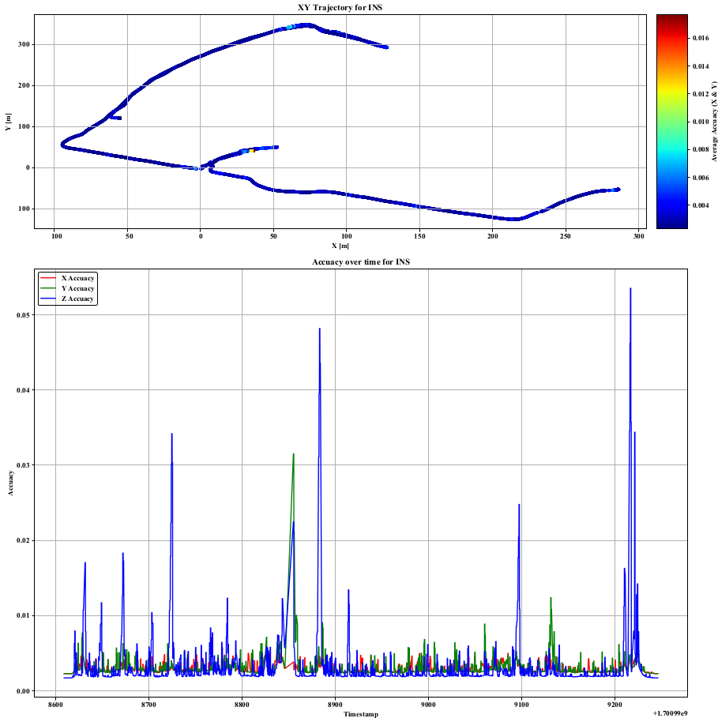
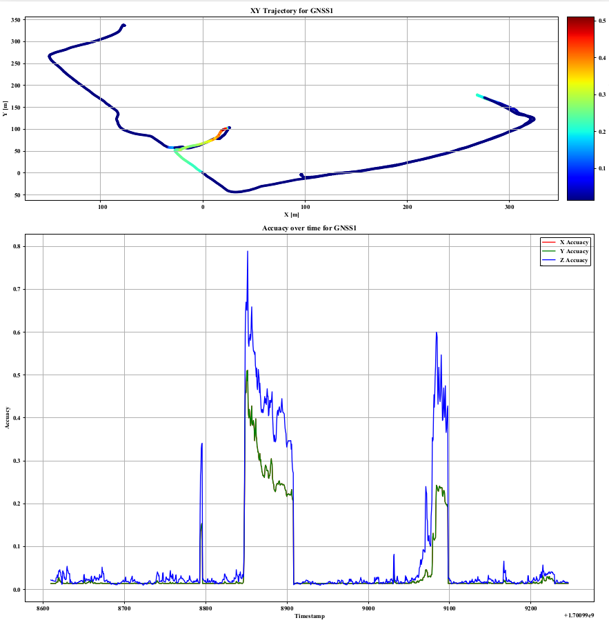
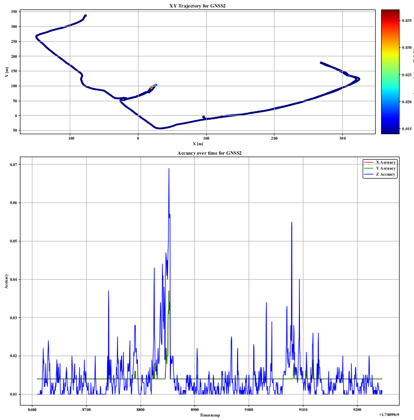
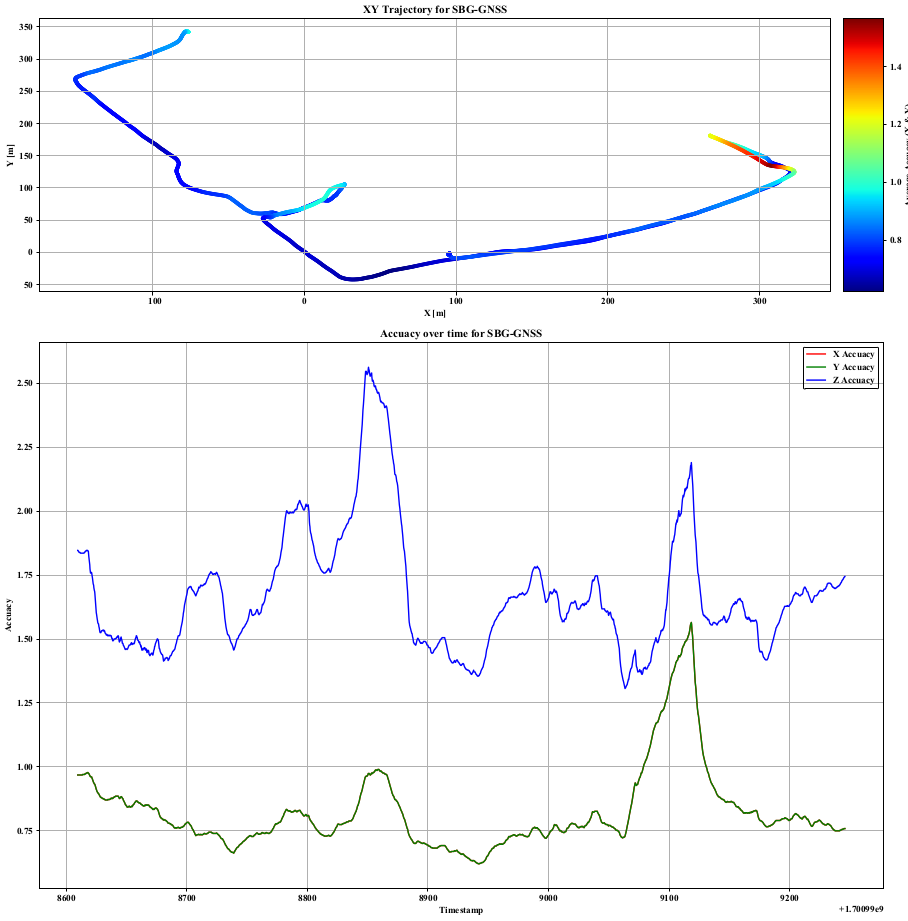

# MS-Dataset
Large scale LiDAR-IMU dataset 

.png)

## sensor config:

- Pandar XT32, +-0.5cm
- SBG INS : 100Hz IMU + GNSS + EKF filter
- 3DM-GQ7 INS: 700Hz IMU + dual GNSS-RTK + 30Hz Filter, >= 1.4cm
- Mono Flir RGB camera (optional), it's hard to collect data with RTK-GNSS and RGB camera at the same time due to USB3.0.
- Ground Truth  RGB Point Cloud Map (indoor -> outdoor), collected by Leica BLK360 and RTC360.

## GT Trajectory

- from INS with cov less than 0.005m. Users can also generate the gt with my scripts.
- Users can generate GT either from RTK-GNSS 1 or RTK-GNSS 2 with my scripts, but only with x y z yaw .
- KML file which can directly import by google map with my scripts.

|      | 3DM-INS                                                      | GNSS1                                                        | GNSS2                                                        | SBG-GNSS                                                     |
| ---- | ------------------------------------------------------------ | ------------------------------------------------------------ | ------------------------------------------------------------ | ------------------------------------------------------------ |
| RB03 |  |  |  |  |
|      |                                                              |                                                              |                                                              |                                                              |

| Dataset | Description | Sensors | Download Links | Ground Truth | Comments |
| ------- | ----------- | ------- | -------------- | ------------ | -------- |
| PK01    |             |         |                |              |          |
| RB02    |             |         |                |              |          |
| RB03    |             |         |                |              |          |
| CP05    |             |         |                |              |          |
